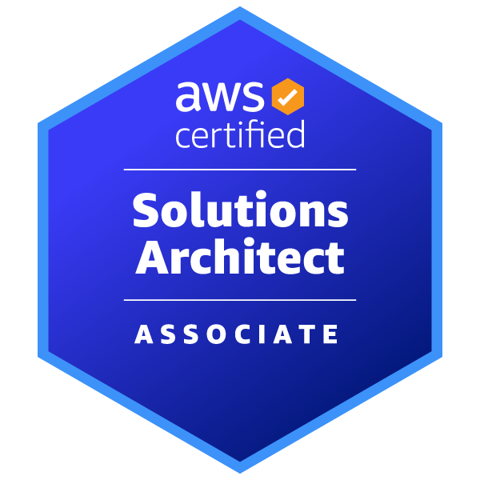
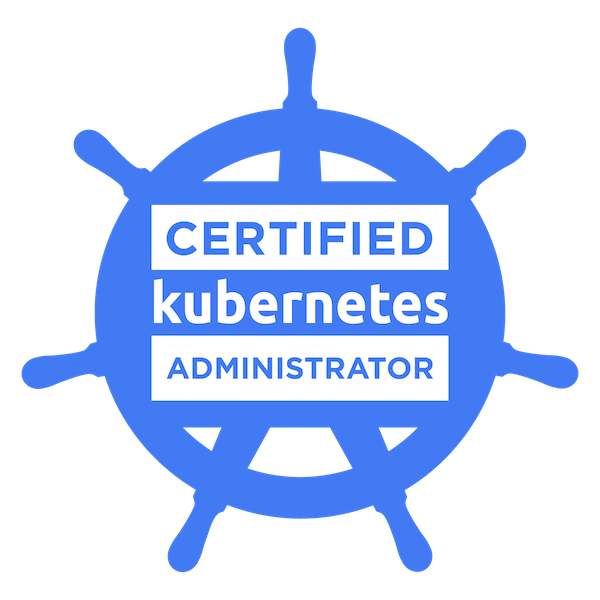

## Hello! 👋

I am interested in AI infrastructure and MLOps, and aspire to build AI systems that continuously evolve through operational data and feedback.

## 📚 Keep Studying

<strong>OS</strong> 

  
  

<strong>Languages</strong> 

  
  

<strong>Infrastructure & DevOps</strong> 

  
  
  
  
  
  

<strong>Monitoring</strong> 

  
  

<strong>Data Engineering</strong> 

  
  
  
  

<strong>MLOps & LLMOps</strong> 

  

## 🤝 Open Source Contributions

### Apache Airflow

- [PR #66086](https://github.com/apache/airflow/pull/66086) — Improved Korean translations for the Airflow UI 
  Added and refined missing Korean translations for the empty log-search state and the DAG UI.

- [PR #67298](https://github.com/apache/airflow/pull/67298) — Fixed tenant-aware ingestion for Weaviate 
  Fixed the Weaviate Provider so that data ingestion works correctly in tenant-aware environments.

### vLLM

- [PR #51664](https://github.com/vllm-project/vllm/pull/51664) — Fixed Helm chart resource references 
  Ensured that Deployments, Services, and HPAs consistently reference release-specific resources when using custom labels and autoscaling.

## 🏅 Certifications

  
  

## 🧑‍💻 Contact me

    
